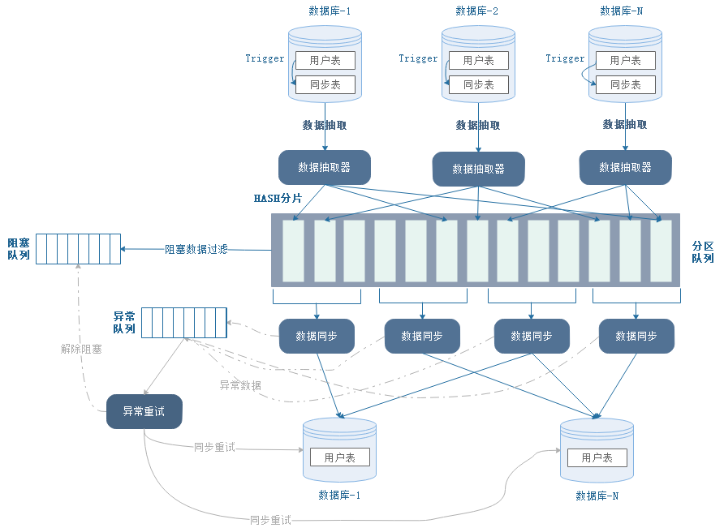

# 总体架构

数据同步使用`数据库Trigger`机制捕获源数据库数据变化, 通过通过`数据抽取器`对各个数据源进行数据抽取, 使用Hash对数据进行分片放入分区队列中. 数据同步线程从分区队列中拉取数据进行数据同步.

## 数据抽取及分区

每个源数据库对应一个或多个抽取线程,对数据表`sync_data`中的数据进行抽取. 数据按partition字段分区, 每个抽取线程负责分区的一段(分区段).
抽取完成后将抽取状态存入抽取状态表`sync_polled`中.

对于抽取到的数据, 按照`源数据库+源schema+源表+主键`计算HASH值, 并将HASH值取模`同步线程数`放入分区队列中.

## 数据同步

每个数据同步线程负责分区队列中的一个分区和阻塞队列中的一个分区, 为保证数据的强顺序性, 同步线程每次抽取先从阻塞队列抽取数据再从分区队列抽取数据. 将抽取的数据按照同步策略进行同步, 按照操作类型和目标数据库尽可能的组合成批量操作以保证同步效率.

## 异常重试

当遇到同步异常时, 将异常数据放到重试队列进行后续重试操作, 同时使用异常数据的HASH值设置BLOCK标记,从分区队列中拉取数据是相同HASH值的数据将被阻塞并放置到阻塞队列(保证强顺序性),其他数据正常处理(保证高可用性).

当重试机制成功重试某一条数据时,将该数据的HASH标记从阻塞标记中移除, 并激活相同HASH的阻塞数据处理.

阻塞粒度为`一亿亿分之一`,即在绝大多数情况下只会对同一条数据的多次操作才会导致异常阻塞.